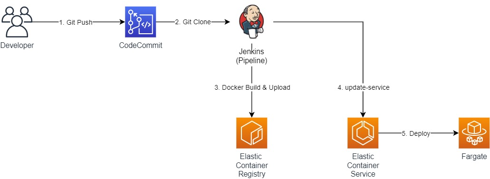
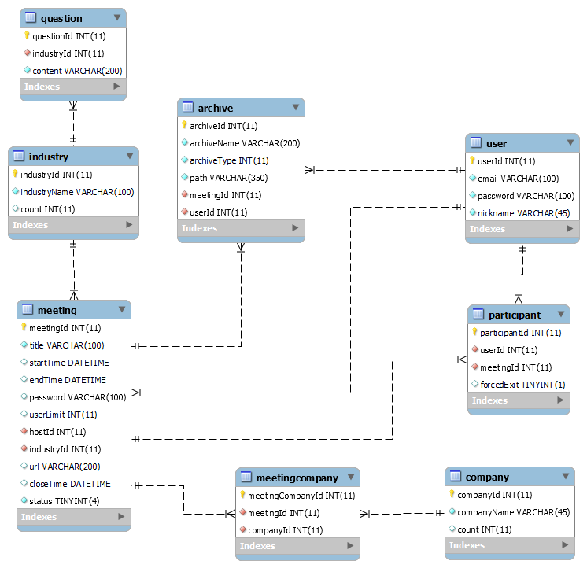

# 웹/모바일(웹 기술) 스켈레톤 프로젝트

<!-- 필수 항목 -->

## 카테고리

| Application | Domain | Language | Framework |
| ---- | ---- | ---- | ---- |
| :white_check_mark: Desktop Web | :black_square_button: AI | :white_check_mark: JavaScript | :white_check_mark: Vue.js |
| :white_check_mark: Mobile Web | :black_square_button: Big Data | :white_check_mark: TypeScript | :black_square_button: React |
| :white_check_mark: Responsive Web | :black_square_button: Blockchain | :black_square_button: C/C++ | :black_square_button: Angular |
| :black_square_button: Android App | :black_square_button: IoT | :black_square_button: C# | :white_check_mark: Node.js |
| :black_square_button: iOS App | :black_square_button: AR/VR/Metaverse | :black_square_button: Python | :black_square_button: Flask/Django |
| :black_square_button: Desktop App | :black_square_button: Game | :white_check_mark: Java | :white_check_mark: Spring/Springboot |
| | | :black_square_button: Kotlin | |

<!-- 필수 항목 -->
## 📢 프로젝트 소개

### :question: 왜 INVIEW를 사용해야 할까요?
- INVIEW는 취업준비생들에게 온라인 공간에서 빠르고 손쉽게 면접 상대를 찾을 수 있게 도와주는 프로젝트입니다.
 
 

### :star2: 특징
- 사용자들에게 화상 채팅과 면접 연습을 위한 다양한 기능을 제공합니다.
- 대기가 길다고요? 누구나 방장 또는 참여자가 될 수 있습니다.
- 쉽고 간편하게 자신만의 면접 연습을 기록하세요. 
  

### :gift_heart: 주요 기능
    * 회원 관리 (회원가입, 로그인, 수정, 탈퇴)
    * 화상 채팅 (비디오/ 마이크 On/Off)
    * 그룹 채팅 
    * 외 사용자 편의 기능 
      (🗂️면접 연습 기록 조회, 🥇면접 평가지 제공, 📎파일 공유, ⏱️타이머)
 

### ⚙️ 주요 기술
    * WebSocket/ WebRTC
      => INVIEW는 사용자간의 지속적이고 안정적인 통신을 위해 Web Socket을 기반하여 화상 채팅을 구현합니다. 
    * Spring Security/ JWT Authentication
      => 사용자의 간편 로그인과 보안을 위해 Spring Security를 통해 사용자 정보를 암호화 합니다.
    * JPA
      => 빠른 개발을 위해 JPA를 통해 데이터를 조작합니다.
    * REST API
      => Server와 Frontend와의 효율적인 협업을 위해 REST API방식으로 통신합니다.
 

### 💎 참조 리소스
    * Element Plus: 디자인 전반 적용
    * Bootstrap: 디자인 전반 적용
    * Lottie Files : 벡터기반의 오픈 소스 애니메이션 파일. 디자인 포인트로 활용
    * Kurento Media Server: 화상 채팅 구현 사용
    * STOMP : 텍스트 채팅 구현 사용
    * Sock JS : 웹소켓 미지원 브라우저와의 호환을 위해 사용
 

### :ship: 배포 환경
    URL : [https://i6a201.p.ssafy.io/]

    테스트 계정 (ID/PW): 
        - 컨설턴트용 접속 계정
            - 사용자1 - [ssafy1@ssafy.com] / password1234
            - 사용자2 - [ssafy2@ssafy.com] / password5678
        - 실습코치용 접속 계정 :
            - 사용자3 - [ssafy3@ssafy.com] / password9876
            - 사용자4 - [ssafy4@ssafy.com] / password5432

<!-- 자유 양식 -->

## 팀 소개 
⭐︎ 이혜민 : 팀장, 백엔드 개발 및 Jira 관리자  
 ⚝ 강수현 : 프론트엔드 개발 및 Designer   
 ⚝ 김한나 : 백엔드 개발 및 Git 관리자   
 ⚝ 이규은 : 프론트 엔드 개발 및 발표자  
 ⚝ 손수연 : 백엔드 개발 및 UCC 제작자  
 ⚝ 최정민 : 백엔드 개발 및 AWS, CI/CD 담당자   
 
 

<!-- 자유 양식 -->

## 프로젝트 상세 설명
### 개발 환경

- JIRA : 애자일 및 소프트웨어 개발 프로젝트를 기획, 트래킹 및 관리 협업 툴
- Gitlab : 깃 저장소 및 CI/CD, 이슈 추적, 보안성 테스트 등의 기능을 갖춘 웹 기반의 데브옵스 플랫폼
- Visual Studio Code : JavaScript 및 웹 개발을 위한 소스 코드 편집기, 다양한 확장 기능 제공
- Eclipse : 자바를 비롯한 다양한 언어를 지원하는 프로그래밍 통합 개발 환경

 

### 🔨 기술 스택
- Kurento Media Server, STOMP, Sock JS
- Node.js, Vue3
- Typescript (with Javascript)
- Spring Boot
- Serverless Cloud(AWS)
- CI/CD (Dokcer, Jenkins)

### And Our Basic Skills 🛠️
---
Backend :  

 
Frontend : 

 
 

### 🚩 시스템 구성도

 

### 🎫 ERD 
  * 사용자 정보 저장을 위한 User 테이블
  * 미팅 정보 저장을 위한 Meeting 테이블
  * 미팅 참가자 정보 저장을 위한 Participant 테이블
  * 다양한 파일을 일괄 관리하기 위한 Archive 테이블
  * 직군 정보 저장을 위한 Industry 테이블
  * 회사명 정보 저장을 위한 Company 테이블
  * 직군별 질문지 관리를 위한 Question 테이블
  
   

 

### 기능 상세 설명
👉️ [기능 설명 & 시연 시나리오](https://hana-275-programming.notion.site/a240903ebc7b499aa998b2f3c1a8eb4c) 👈️

 1. 유저 - 회원 가입, 이메일 인증, 닉네임&이메일 중복 검사, 카카오 로그인, 일반 로그인, JWT 토큰 검증, 회원정보 수정, 회원탈퇴, 비밀번호 찾기, 
 2. 미팅 관리 - 미팅 생성, 미팅 삭제, 미팅 수정, 미팅 참가, 미팅 조회, 미팅 검색 및 미팅 필터링, 미팅 비밀번호 검증

 3. 미팅 참여 - 미팅 대기실, 텍스트 채팅, 화상 채팅, 참여자 목록 확인, 파일업로드, 미팅 종료, 녹화, 마이크&카메라 on/off, 참가자 강제퇴장, 기본 면접 평가지 제공, 면접 평가 저장, 랜덤 방장 선출, 면접 답변용 타이머 기능(30초, 60초, 90초), 미팅 녹화    

 4. 미팅 결과 조회 - 미팅 녹화 파일 다운로드(수정중), 메모 다운로드, 면접 평가 다운로드, 파일 다운로드, 채팅 내역 다운로드, 파일 내역 조회, 결과 다운 가능 기한 표시

 5. 마이페이지 - 참가한 미팅 내역 조회, 참가 예정 미팅 조회,

 6. 랜딩 페이지 - 사이트 소개 
 7. 메인 페이지 - 키워드 미팅 검색 제공
 8. 상세 검색 페이지 - 미팅 필터링 검색 제공 

